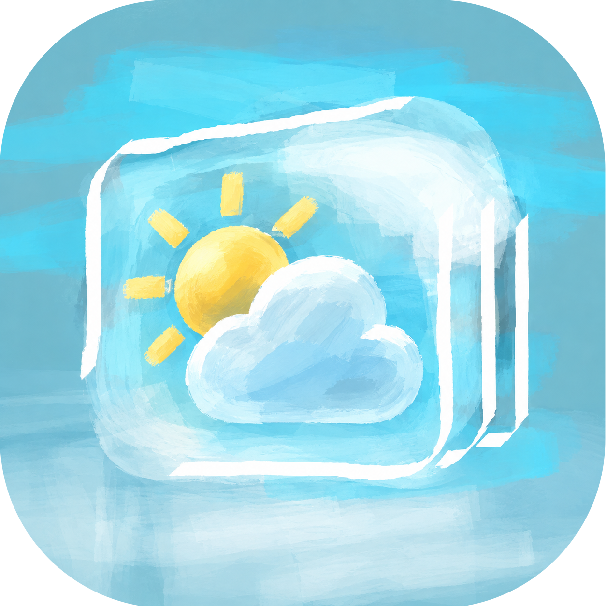

   

<h1>天气</h1>

A Class Widgets plugin.

> [!WARNING]
> **关于兼容性**
> 本插件依赖 `sqlite3` 运行。Class Widgets 2 本体将在 PR[#207](https://github.com/RinLit-233-shiroko/Class-Widgets-2/pull/207) 或 [#222](https://github.com/RinLit-233-shiroko/Class-Widgets-2/pull/207) 之一被合并后，的第一个版本中携带所有标准库，包括 `sqlite3`。在此之后，您应该可以正常使用本插件。
> 截至当前 (26/10/5 11:48)，v0.1.1 还不能被 CW2 正常加载。

## 介绍 / Introduction
Class Widgets 2 的天气插件。

## 使用 / Usage
[从 Web 下载](https://plaza.cw.rinlit.cn/plugins/com.helloswx.weather) 或 [从插件市场安装]

## 致谢 / Acknowledgements
### 引用资源 / Credits
- [Class Widgets 2](https://github.com/rinlit-233-shiroko/class-widgets-2)
- [Class Widgets 2 SDK](https://github.com/Class-Widgets/class-widgets-sdk)

### 贡献者们 / Contributors

## 版权 / License
本项目基于 MIT 协议开源，详情请参阅 [LICENSE](https://github.com/xuanxuan1231/cw2p-com.helloswx.weather/blob/main/LICENSE) 文件。

The project is licensed under the MIT license. Please refer to the [LICENSE](https://github.com/xuanxuan1231/cw2p-com.helloswx.weather/blob/main/LICENSE) file for details.
